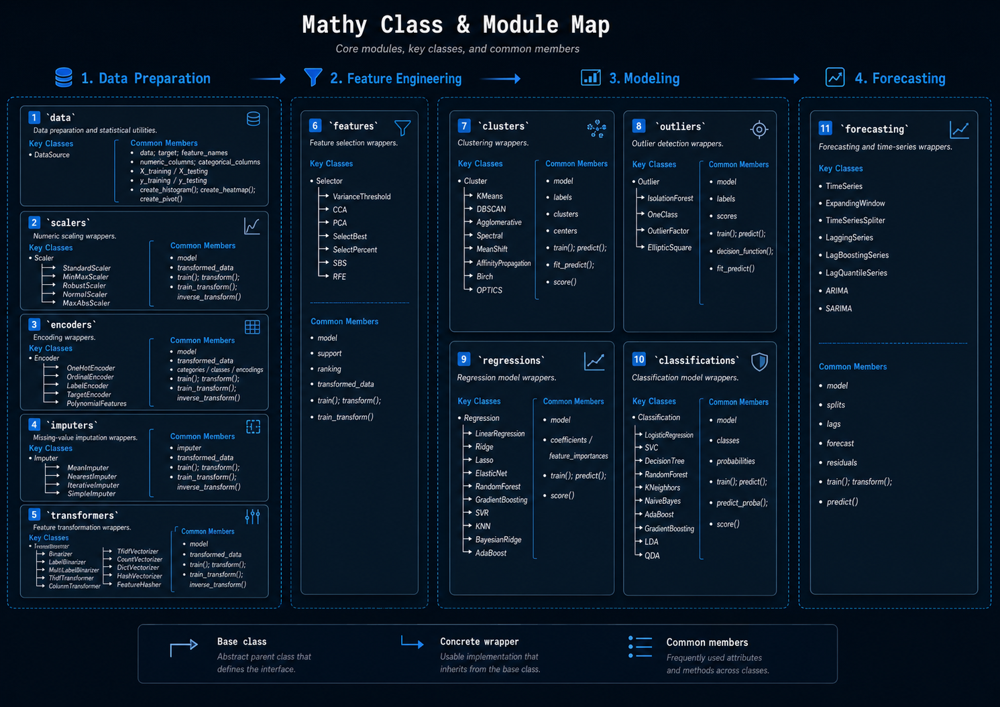

# API Reference

___

The source modules include:

| Module            | Purpose                                     |
|-------------------|---------------------------------------------|
| `data`            | Data preparation and statistical utilities. |
| `scalers`         | Numeric scaling wrappers.                   |
| `encoders`        | Encoding wrappers.                          |
| `imputers`        | Missing-value imputation wrappers.          |
| `transformers`    | Feature transformation wrappers.            |
| `features`        | Feature selection wrappers.                 |
| `clusters`        | Clustering wrappers.                        |
| `outliers`        | Outlier detection wrappers.                 |
| `regressions`     | Regression model wrappers.                  |
| `classifications` | Classification model wrappers.              |
| `forecasting`     | Forecasting and time-series wrappers.       |