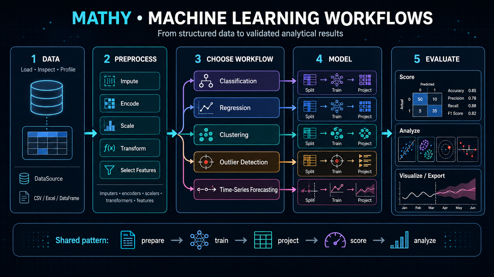

# User Guide


___

The Mathy user guide provides task-oriented examples for preparing data, transforming features,
selecting predictors, training models, detecting outliers, clustering observations, and building
time-series forecasts.

Use this guide when you want to understand how Mathy modules work together in practical workflows.
Use the API reference when you need class-level, method-level, argument, return, or exception
details generated directly from the Python source code.

## 🧭 Guide Overview

Mathy is organized around the major stages of a statistical modeling and machine learning workflow:

| Stage               | Documentation Page                            | Purpose                                                                                                                                                        |
| ------------------- | --------------------------------------------- | -------------------------------------------------------------------------------------------------------------------------------------------------------------- |
| Data Preparation    | [Data Preparation](data-preparation.md)       | Load dataframe inputs, create a `DataSource`, inspect columns, split data, scale values, encode labels, impute missing values, and transform feature matrices. |
| Feature Engineering | [Feature Engineering](feature-engineering.md) | Select features, reduce dimensionality, rank predictors, apply recursive elimination, and prepare model-ready feature sets.                                    |
| Modeling            | [Modeling](modeling.md)                       | Train regression, classification, clustering, and outlier-detection models using Mathy wrappers.                                                               |
| Forecasting         | [Forecasting](forecasting.md)                 | Build time-series splits, lagged features, ARIMA models, SARIMA models, and lag-based forecasting workflows.                                                   |

## 🧱 Typical Workflow

A typical Mathy workflow starts with a pandas dataframe and moves through preparation,
transformation, modeling, and output review.

```python
import pandas as pd
from data import DataSource

df = pd.read_csv("data.csv")

source = DataSource(
    df=df,
    target="target_column",
    size=0.25,
    rando=42
)
```

After creating a `DataSource`, the workflow can branch into preprocessing, feature engineering,
model training, or forecasting.

```text
DataFrame
   |
   v
DataSource
   |
   +--> scaling
   +--> encoding
   +--> imputation
   +--> transformation
   |
   v
Feature selection or dimensionality reduction
   |
   v
Regression, classification, clustering, outlier detection, or forecasting
```

## 🗃️ Data Preparation

The data preparation workflow centers on the `DataSource` class in `data.py`.

`DataSource` provides:

| Capability         | Description                                                             |
| ------------------ | ----------------------------------------------------------------------- |
| Working dataframe  | Stores a copy of the source dataframe.                                  |
| Target tracking    | Stores the selected target column and target values.                    |
| Feature tracking   | Derives non-target feature columns.                                     |
| Column typing      | Detects numeric and categorical columns.                                |
| Summary statistics | Computes descriptive statistics for numeric columns.                    |
| Splitting          | Creates train/test splits using the selected test size and random seed. |
| Plotting           | Supports histogram and heatmap generation.                              |
| Pivoting           | Supports pivot-table creation for grouped analysis.                     |

## 🧪 Preprocessing

Mathy preprocessing modules prepare feature matrices before modeling.

| Module            | Main Classes                                                                                           | Purpose                                                              |
| ----------------- | ------------------------------------------------------------------------------------------------------ | -------------------------------------------------------------------- |
| `scalers.py`      | `StandardScaler`, `MinMaxScaler`, `RobustScaler`, `NormalScaler`, `MaxAbsScaler`                       | Scale numeric features.                                              |
| `encoders.py`     | `LabelEncoder`, `OrdinalEncoder`, `OneHotEncoder`, `TargetEncoder`, `PolynomialFeatures`               | Encode categorical values and expand features.                       |
| `imputers.py`     | `MeanImputer`, `NearestImputer`, `IterativeImputer`, `SimpleImputer`                                   | Replace missing values.                                              |
| `transformers.py` | `Binarizer`, `LabelBinarizer`, `TfidfVectorizer`, `CountVectorizer`, `DictVectorizer`, `FeatureHasher` | Transform numeric, categorical, text, dictionary, and sparse inputs. |

## 🧬 Feature Engineering

Feature engineering is handled through `features.py`.

Use feature engineering when you need to:

| Task                           | Example Classes               |
| ------------------------------ | ----------------------------- |
| Remove low-variance predictors | `VarianceThreshold`           |
| Reduce dimensionality          | `PCA`, `CCA`                  |
| Select top predictors          | `SelectBest`, `SelectPercent` |
| Apply sequential selection     | `SBS`                         |
| Apply recursive elimination    | `RFE`                         |

## 🤖 Modeling

Mathy separates modeling workflows by analytical purpose.

| Modeling Type     | Module               | Output                                                               |
| ----------------- | -------------------- | -------------------------------------------------------------------- |
| Regression        | `regressions.py`     | Continuous predictions and regression scores.                        |
| Classification    | `classifications.py` | Class predictions, probabilities, labels, and classification scores. |
| Clustering        | `clusters.py`        | Cluster assignments and clustering diagnostics.                      |
| Outlier Detection | `outliers.py`        | Outlier labels, anomaly scores, or fitted detection models.          |

## 📈 Forecasting

Forecasting workflows are handled in `forecasting.py`.

Use forecasting classes when observations are ordered by time and model validation must respect that
order.

Common forecasting tasks include:

| Task                        | Purpose                                                                        |
| --------------------------- | ------------------------------------------------------------------------------ |
| Time-series splitting       | Preserve temporal ordering during model validation.                            |
| Expanding-window validation | Grow the training window across successive splits.                             |
| Lagged feature construction | Create predictor columns from prior observations.                              |
| Lag-based modeling          | Fit supervised models against lagged time-series inputs.                       |
| ARIMA/SARIMA modeling       | Fit statistical forecasting models for trend, autoregression, and seasonality. |

## 🧯 Error Handling

Mathy source modules use a consistent wrapped exception pattern with `boogr.Error` and
`boogr.Logger`.

The pattern records:

| Field            | Purpose                                            |
| ---------------- | -------------------------------------------------- |
| `module`         | Identifies the source package or module family.    |
| `cause`          | Identifies the class or function context.          |
| `method`         | Stores a stable method signature.                  |
| logged exception | Writes the wrapped exception before re-raising it. |

For methods with multiple parameters, the logged method string uses a compact `*args` signature.

```python
exception.method = 'method_name( self, *args ) -> return_type'
```

This prevents logs from storing live values, dataframe contents, file paths, user data, or
runtime-specific inputs.

## 📚 API Reference

The API reference is generated from the source code with MkDocs and mkdocstrings.

Use the API reference when you need:

| Detail               | Source                                           |
| -------------------- | ------------------------------------------------ |
| Module documentation | Module-level Google-style docstrings.            |
| Class documentation  | Class docstrings and attributes.                 |
| Method signatures    | Python function signatures and type annotations. |
| Arguments            | Google-style `Args:` sections.                   |
| Return values        | Google-style `Returns:` sections.                |
| Raised exceptions    | Google-style `Raises:` sections.                 |
| Source links         | MkDocs source rendering where enabled.           |

